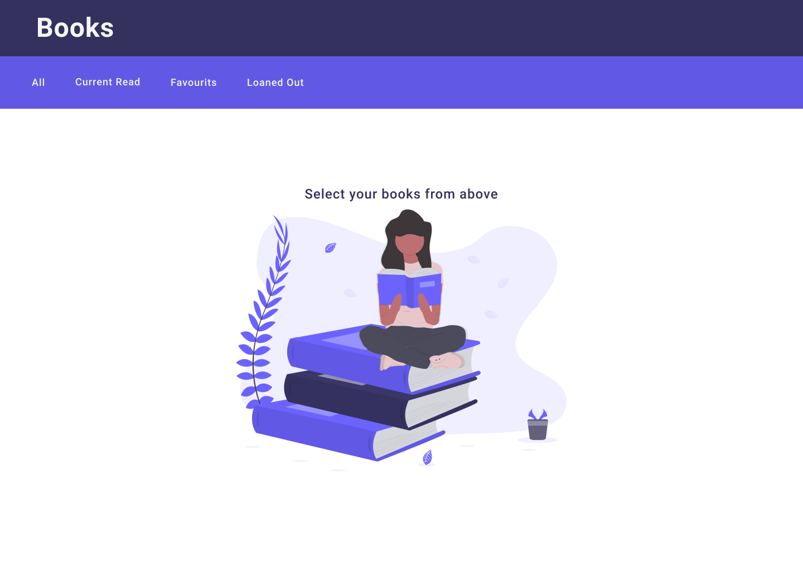

## A project to keep track of and manage your book library.

Planned stack:
Frontend: ReactJS (https://reactjs.org)
UI: Material-UI (https://material-ui.com/)

## Planned features:

Home page with selection to view library by:

- All books
- Loaned out
- Reading status
- Favorites

Todo:

1. Wireframe / Layout
2. Define containers and components
3. Build home page
4. Open library by view
5. Add new book

## Future versions:

Add backend (NodeJS / Express) for:

- Persisting to database
- Authentication (Auth0)
